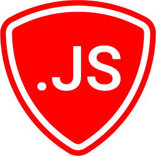

# SB.js

[SponsorBlock](https://github.com/ajayyy/SponsorBlock) for restrictive environments. When possible, use the browser extension.

## Changes in this fork
- Moved settings to [MonkeyConfig](https://github.com/odyniec/MonkeyConfig) to make the settings persistent over script updates.

Updated userscript: [sb.user.js](https://github.com/Apina-32/sb.js/raw/main/docs/sb.user.js)

